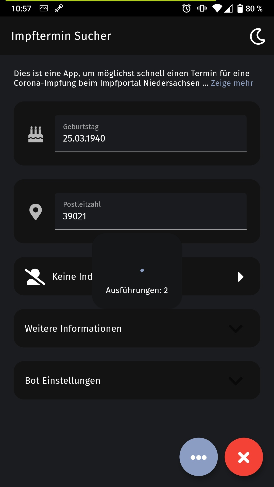

# Vaccination Bot
This Application requests information from the [vaccination website](https://www.impfportal-niedersachsen.de/portal/#/appointment/public) of lower saxony concerning open vaccination appointments.  
Once such an appointment is found, the user gets a notification which forwards him to the website, where inforation and human autentifications have to be solved.

## Disclaimer
It can happen that you get a notification, tab on it and see that there is no appointment available.
This has been tested and is either because the [vaccination website](https://www.impfportal-niedersachsen.de/portal/#/appointment/public) sends wrong information or bc someone else uses a bot which works faster. All I can say is better luck next time 🤞.

## Features
- background execution to ping the [vaccination website](https://www.impfportal-niedersachsen.de/portal/#/appointment/public)
- automatic forwarding to the search page
- automatic form filling
- white/ dark theme
- local save of input data
## Steps for the best functionality
1. Fill in all requested user data. (The information is only saved on the device locally.)
2. Hit the green checkmark to start the process.
3. Agree to the background execution.
4. You can now do something else. The app will run in the background and notifies you once an appointment is open.
5. *Once you get a notification.*
6. Tab the notication and fill out requested captcha and sms authentication.
7. Once you reach the personal data form, you can hit the script button to automate the task of filling out the form.
8. Be fast to specify the appointment, as these are only blocked once you hit the last confirm button.

## Screenshots
The app auto-supports german and english language. Screenshots were made on a german android version.

### Start Page

 

### Expanded Description

 

### Vaccination Indication Dialog

 

### Further Personal Information

 

### Bot Settings

 

### Background Execution Started

 

### Webview with Script Button

